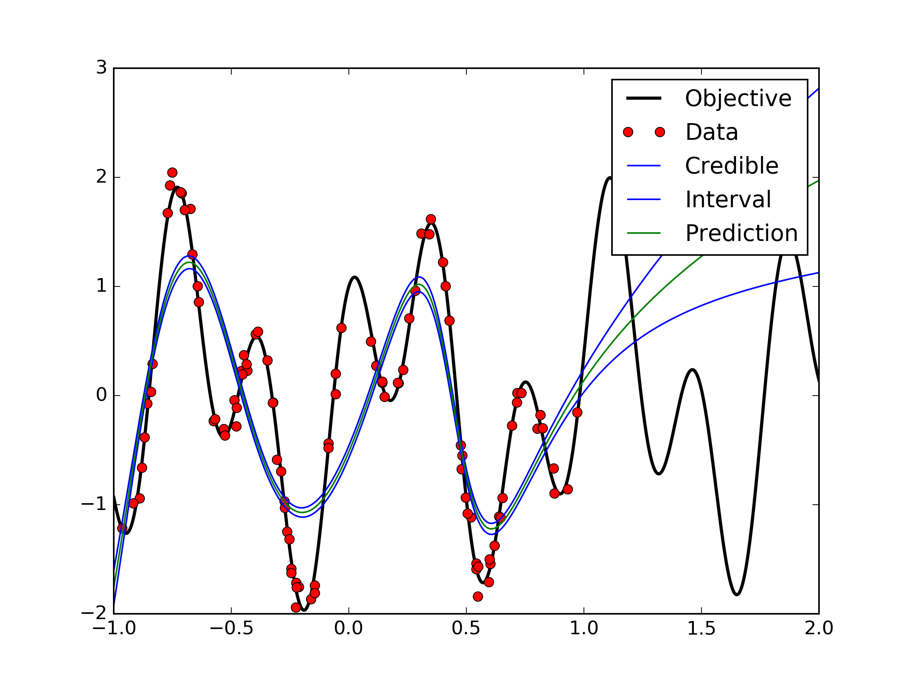

###BNN with HMC preliminary results

1->20->1

same priors used on both weights

No gibbs sampling to update priors

Unsure about how the uncertainty estimates should be obtained. Following code fragment was used. op_samples has outputs of the neural networks taken over 1000 samples from HMC. The 1000 samples are taken after a 1000 sample burnin. 

    y_sd = np.std(op_samples,axis=0)
    
    
With more hidden_width
hwidth=50

hWidth=100

---

The noise var in the output was decreased 

--

More Complicated NN using 1->50->50->50->1

precisions =[10,7,7,10]
hWidth=[50,50,50]