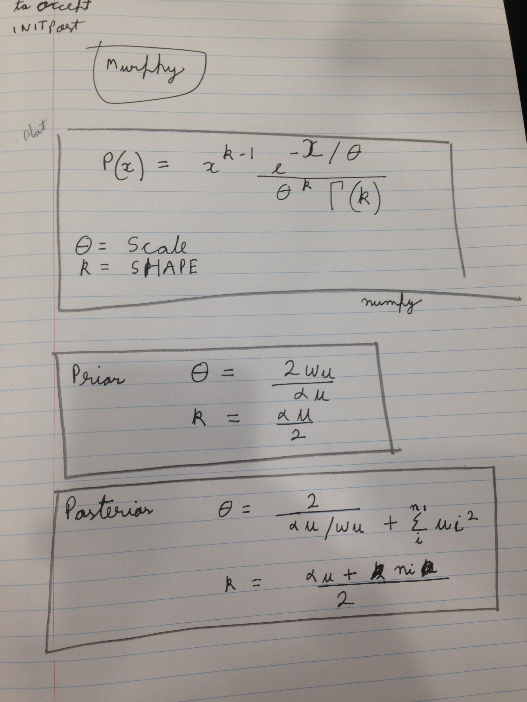

```
    #weights is list with weight matrices of different layers
for i in range(len(weights)):
            a=(np.sum(np.square(weights[i])) + np.sum(np.square(biases[i])))

            b=weights[i].size + biases[i].size
            scales[i]= 2.0/( (2.0/scales[i]) + a)
            shapes[i]= shapes[i] + b/2.0
				#scales[i] has the param for gamma distr belonging to weights of the current layer
            gamma_samples[i]=np.random.gamma(shapes[i],scales[i])

```

The problem is that the parameter theta of the gamma distribution , very quickly becomes very small. 

I should have more thorough tests soon
            