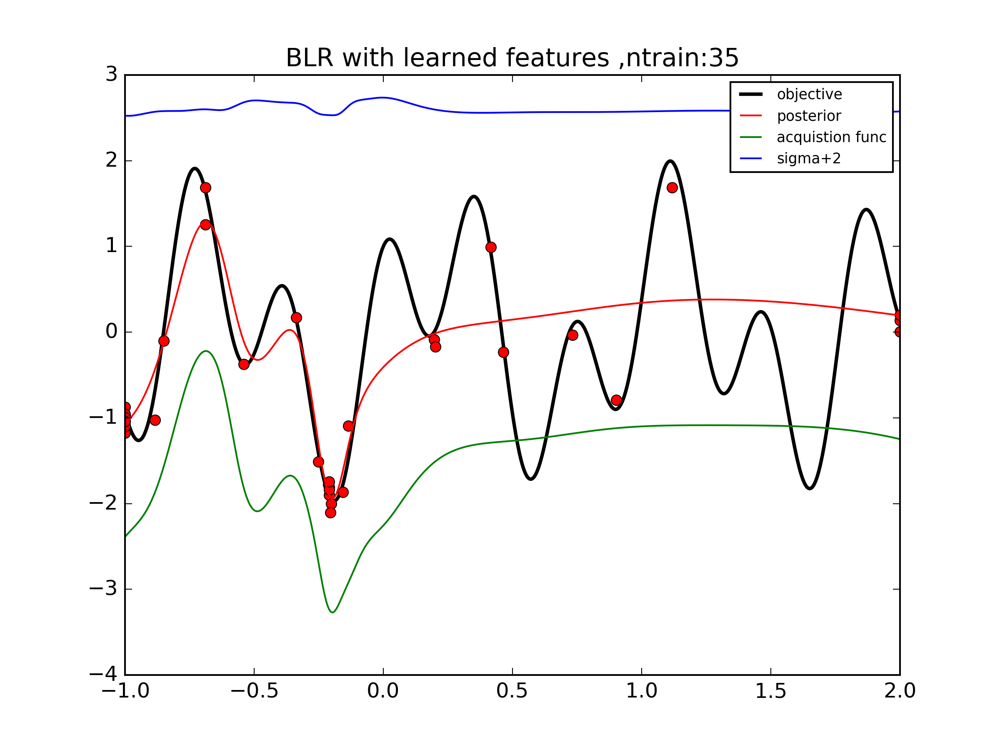
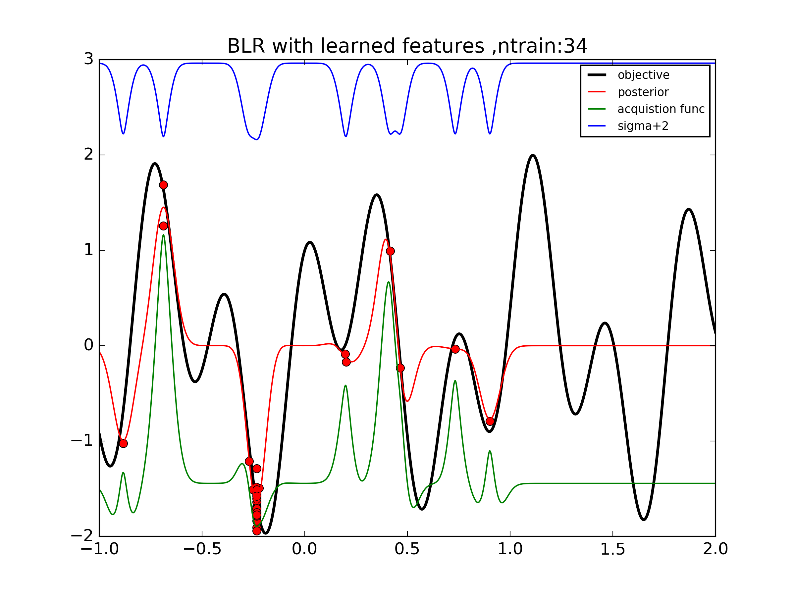
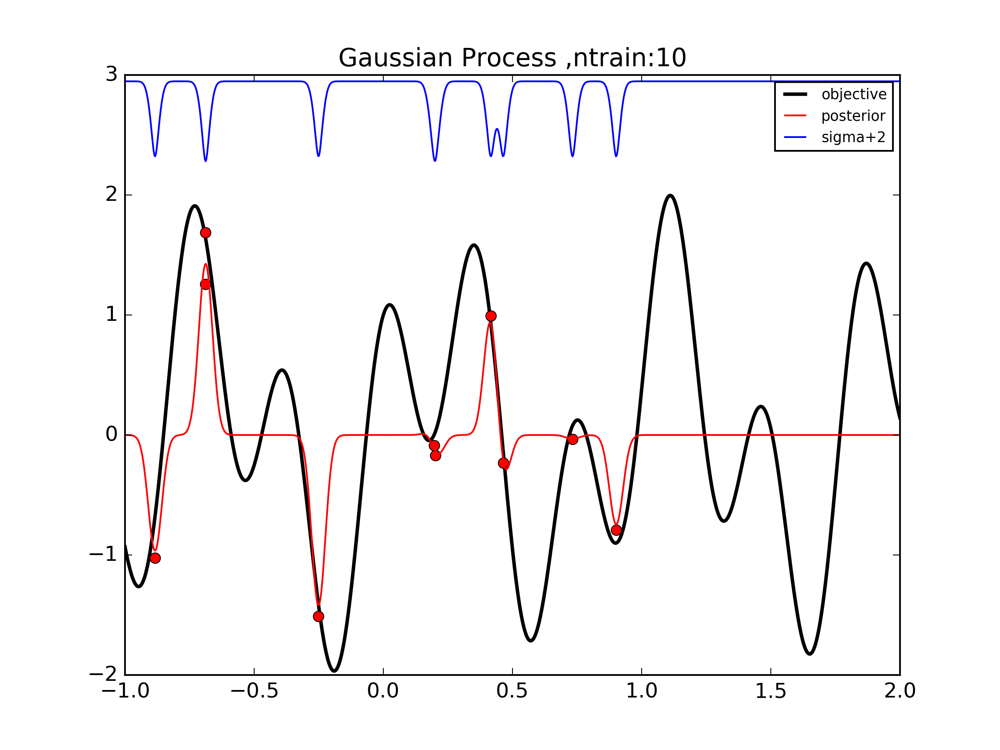
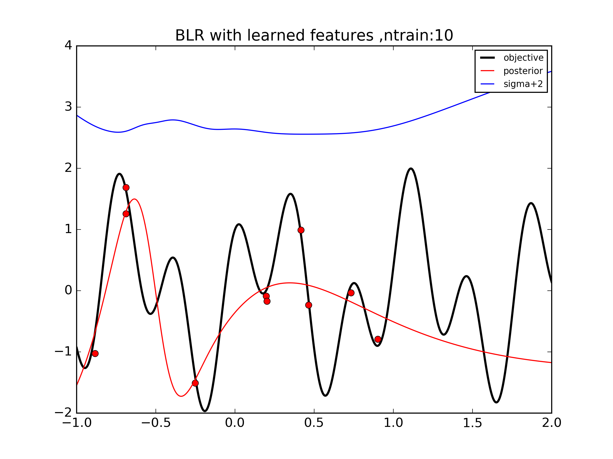

###Diagnostic tests on BLR + NN

Attempting to recreate Snoeks paper on BLR+NN

Objective func 

f(x) = sin(7x) +cos(17x)

Trained with 50 data points .Figure below simply observes the performance of the NN on the data


Neural Net used 

1 -> 50 -> 50 -> 50 -> 1 

tanh non linearity 


--


###Performance of BLR

The bayesian linear regressor takes the activations of the NN as inputs to probabilistically model the function

With 50 train points


With 20 train points


-- 

Training points spread around 


--

Simple GP
150 train points


--

##BayesOPt

Using GP-UCB

```
def acquisition_UCB(m, s, k):
    a = m - k * s
    return a
```

BLR+NN does not seem to model uncertainties very well. Its ok but not as accurate as a GP

This makes BO challenging 

The magnitude of S.D was shifted and plotted separately. Standard deviation does not accurately describe our beliefs about the uncertainty in the function





For comparison , GP's show more accurate reflection of our beliefs about uncertainty 




##Uncertainties

Using same dataset on GP and NN+BLR





