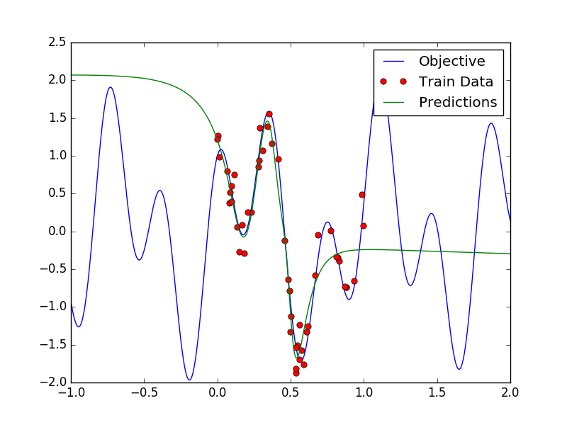
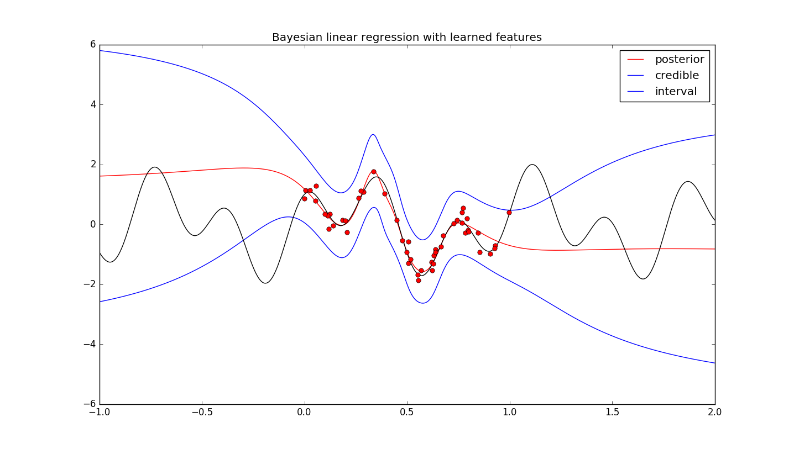
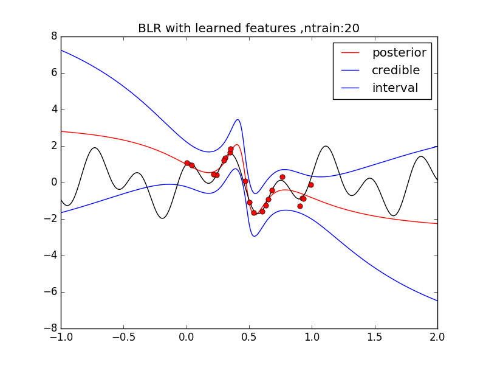
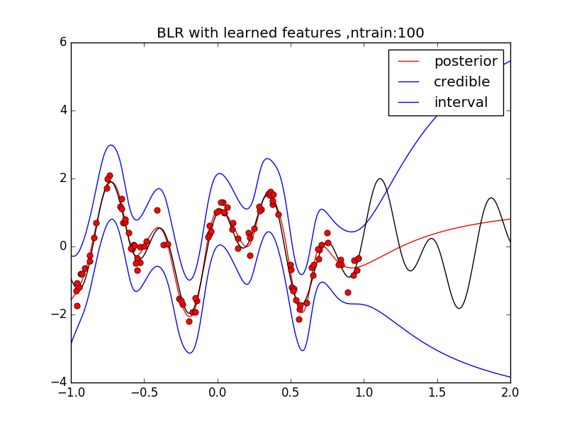
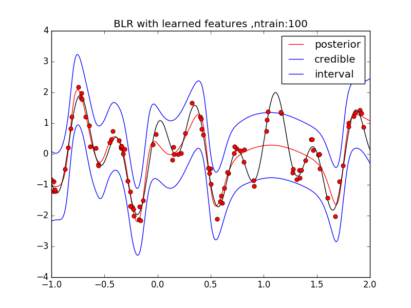
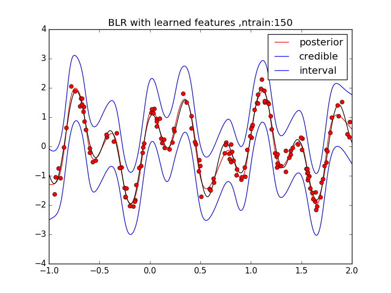
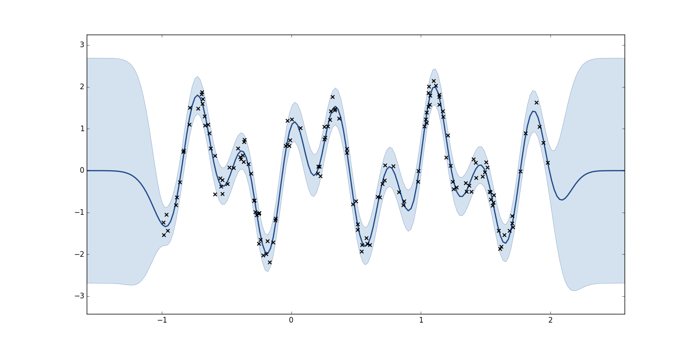

###Diagnostic tests on BLR + NN

Attempting to recreate Snoeks paper on BLR+NN

Objective func 

f(x) = sin(7x) +cos(17x)

Trained with 50 data points 

Figure below simply observes the performance of the NN on the data



Neural Net used 

1 -> 50 -> 50 -> 50 -> 1 

tanh non linearity 


--


###Performance of BLR

The bayesian linear regressor takes the activations of the NN as inputs to probabilistically model the function

With 50 train points



With 20 train points




-- 

Training points spread around 









--

Simple GP
150 train points



--

For this particular objective function it would not really make sense to use give the GP a 50D input.

--

##BayesOPt

Using GP-UCB

```
def acquisition_UCB(m, s, k):
    a = m - k * s
    return a
```


