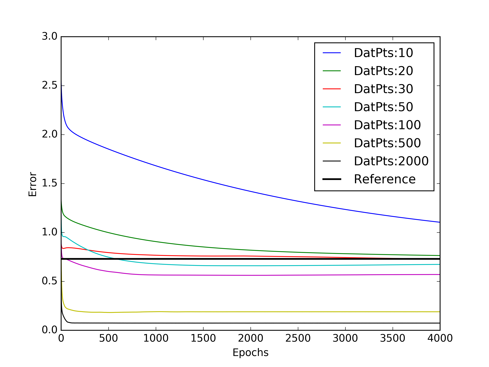
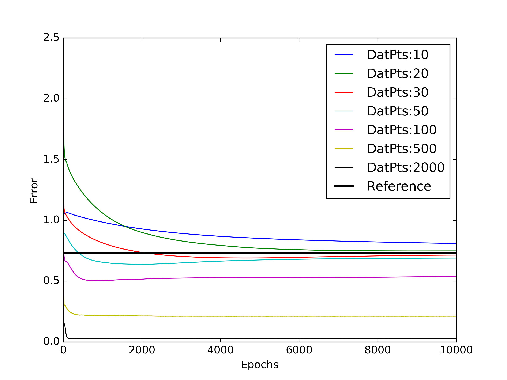

##Exp4

Plotting evolution of test error for various number of training points. L2reg=0.01 , Hwidth = 10, MiniBatchSize=5.

Reference error of 0.7297 was obtained by using simple mean prediction

Atleast a 100 training points were needed for getting performance better than the reference

##Exp5

Test error after 1000 epochs, was plotted against num training points for various amounts of L2 regularisation.

###Appendix

A test run of Exp4 with 10000 epochs was done.

