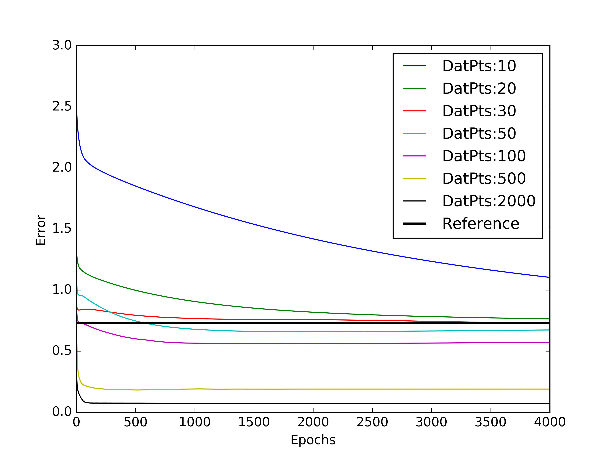

##Exp4

Plotting evolution of test error for various number of training points. L2reg=0.01 , Hwidth = 10, MiniBatchSize=5.

Reference error of 0.7297 was obtained by using simple mean prediction

Atleast a 100 training points were needed for getting performance better than the reference

##Exp5

Test error after 1000 epochs, was plotted against num training points for various amounts of L2 regularisation.

It can be seen that for L2reg=1 and L2reg=100, performance is same as that for the reference case. 
Moderate values of L2reg(0.01 and 0.1) give good performance in the low data regime. But very small values of L2reg(0.001) give even better performance when plentiful data is available.

Edit: Note: 500 test points are used. Some curves simply disappear into the reference plot

###Appendix

A test run of Exp4 with 10000 epochs was done.

