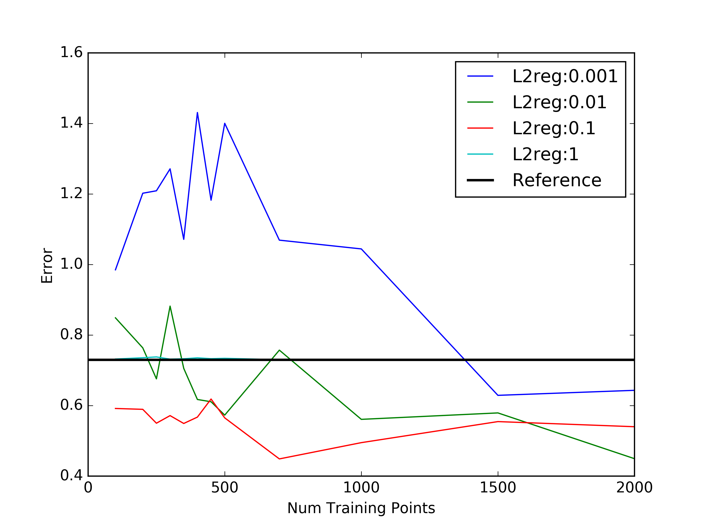
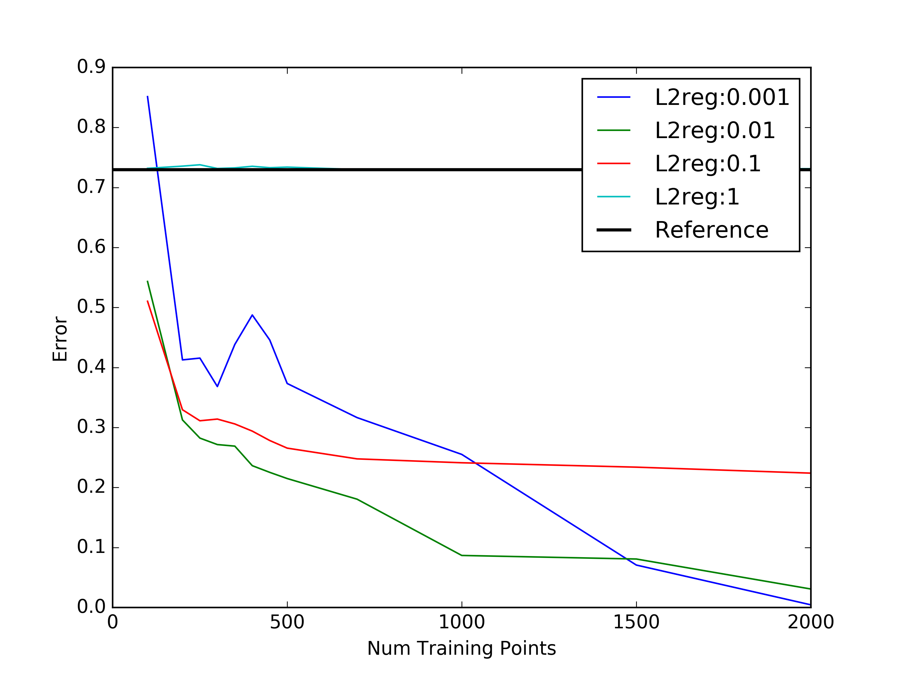
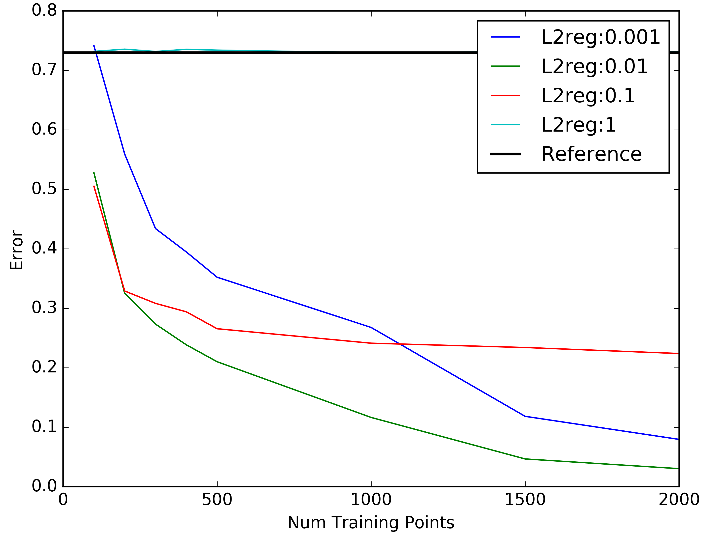

###Meeting Notes

Training Neural Networks with small number of data-points

Repeating Exp5 with more detail

Exploring Evolution of Error with increasing number of data points used in training

With Random projection 100->50 

Without random Projections

NumTP: 100, L2reg: 0.01, Train: 0.0173428927109, Test: 0.543395419895  
NumTP: 200, L2reg: 0.01, Train: 0.0246613751578, Test: 0.312654106272  
NumTP: 400, L2reg: 0.01, Train: 0.0103497703989, Test: 0.23638128781

Train errors are very low and suggest some that there is overfitting

--

To be sure about Figure 2 run an averaging test

