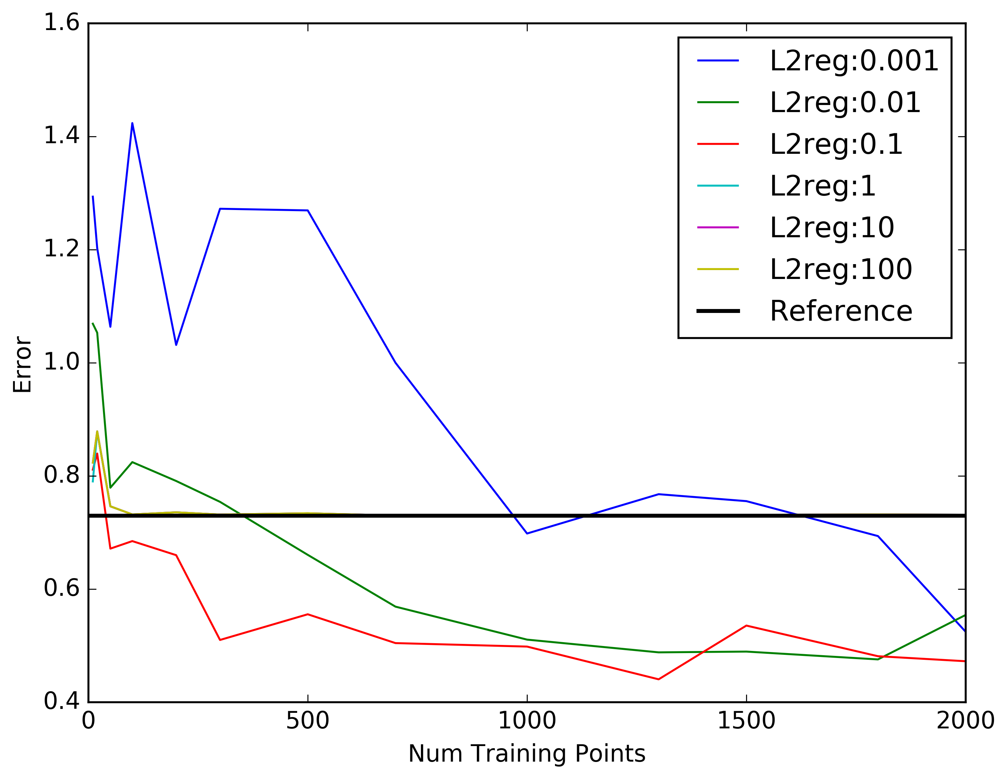

#Random Projections

##Exp6

```python
def proj_matrix(shape):
	scale = sqrt(6. / (shape[1] + shape[0]))
	return floatX(np.random.uniform(low=-scale, high=scale, size=shape))
	
proj_mat=proj_matrix((100,proj_width))
X_train=np.dot(X_train,proj_mat)
X_test=np.dot(X_test,proj_mat)
```
each element of random projection matrix chosen randomly from uniform distribution


**Simple check**

Without random projection

    mlp_synthetic(L2reg=0.0001, numTrainPoints=2000,proj_width=100,mini_batchsize=5)
    >>>NumTP: 2000, Hwidth: 10, BatchSize: 5, L2reg: 0.0001,Train: 0.00179861398386, Test: 0.0069205807329

    
    

With Random Projection, of same width 100->100

    mlp_synthetic_proj(L2reg=0.0001, numTrainPoints=2000,proj_width=100,mini_batchsize=5)
    >>>NumTP: 2000, Hwidth: 10, BatchSize: 5, L2reg: 0.0001,Train: 0.0135878321865, Test: 0.0552236782083


The performance after random projection is expected to be the same but is in practise much worse


--

Exp5 was repeated with a random projection 100->50 




The performance is much worse than before, there is some hope with very low L2 reg

--

Repeat of last experiment with lower L2 regs and higher epochs epochs =10000


This showed much worse performance than before


--

Repeat with projection 100->80. Epochs 10000


--

Repeat with 100->30. Epochs 10000


--

Repeat of exp4 with evolution of graphs over epochs 

L2reg=0.001

Having more than 1000 epochs does not give any benefit and can often lead to loss of performance 


--
Checking variability with Random seeds


NumTP: 2000, Hwidth: 10, BatchSize: 5, L2reg: 0.0001,Train: 0.00669897739224, Test: 0.0413146919675, seed 30

NumTP: 2000, Hwidth: 10, BatchSize: 5, L2reg: 0.0001, Seed 100,Train: 0.0037263116016, Test: 0.0184587812897

NumTP: 2000, Hwidth: 10, BatchSize: 5, L2reg: 0.0001, Seed 20,Train: 0.00208339830211, Test: 0.00696060507061


