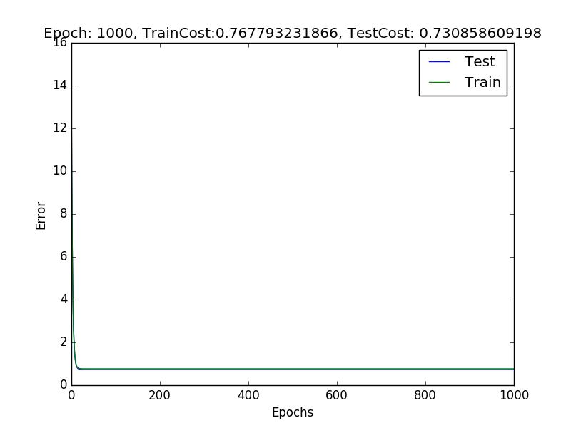
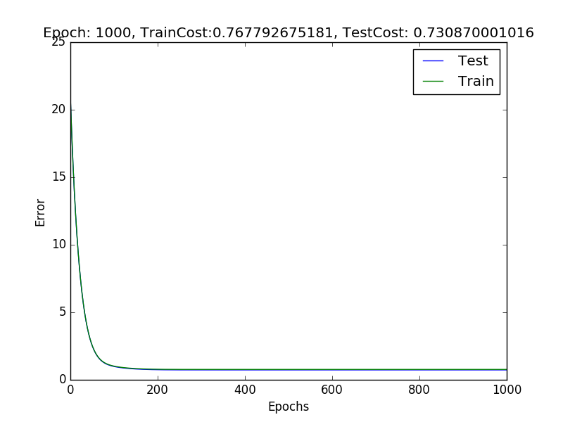
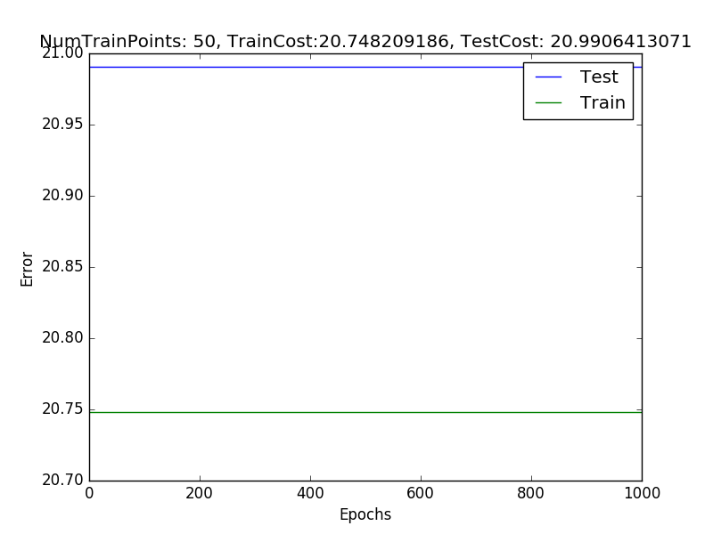
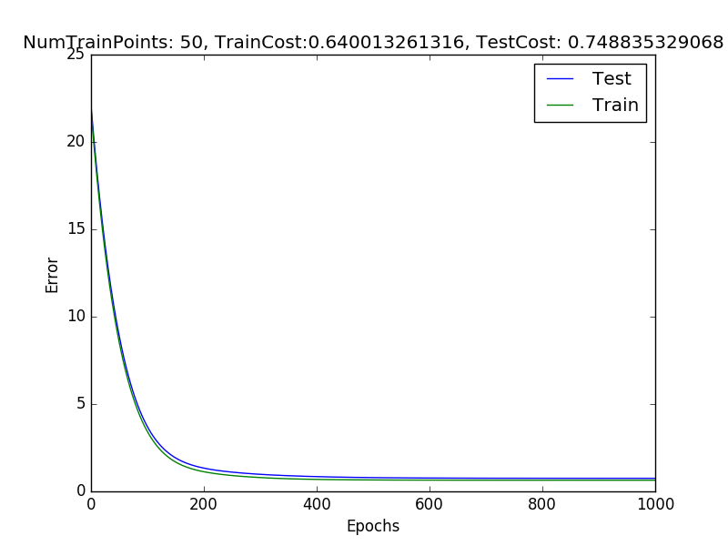
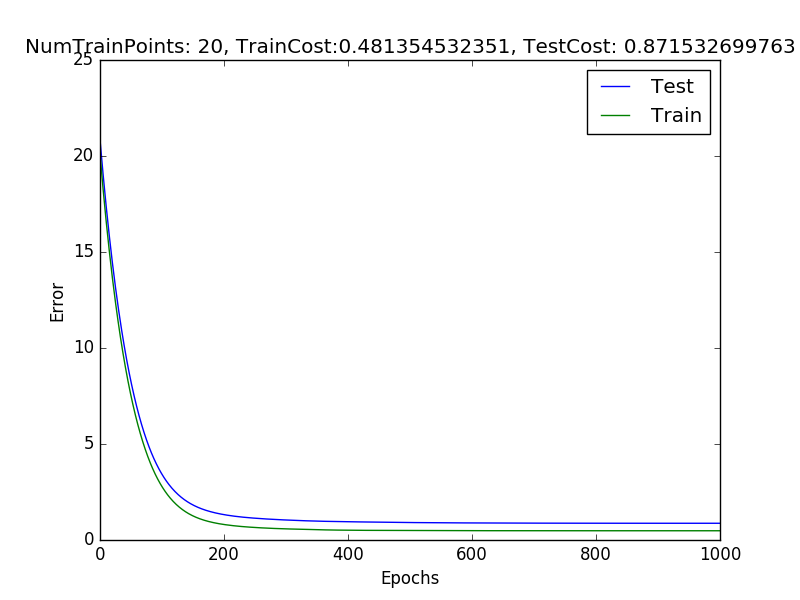
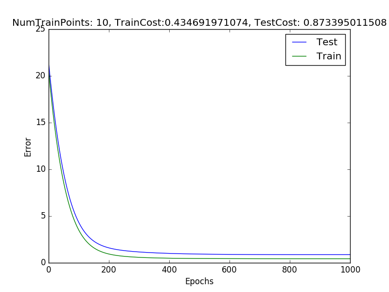
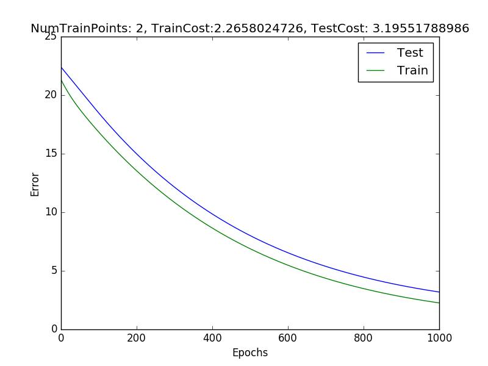
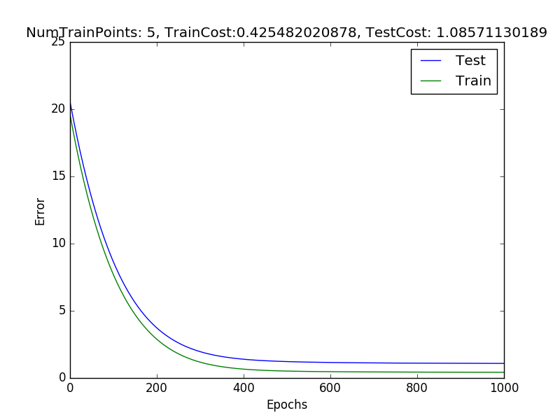

#Logs
Documenting Experiments

##Synthetic Dataset
Use synthetic dataset generated using NN(100->10->1), for practising training new Neural networks

###Exp1
Check the convergence 

Simple SGD 

Adam 

--

Final values of error obtained were similar after a 1000 iterations. However contrary to popular belief Simple SGD converged much quicker than ADAM. Possibly the more complicated error landscape in ADAM makes it slower for such a simple Synthetic problem.

Note: default parameters for ADAM were used

--

The test and Train error are very similar strongly suggesting no overfitting

Train Datapoints -2000
Num Parameters- 100 * 10 + 10 * 1 = 1010

--

Suggested work 
Hyperparameter optimisation, not very high priority

--
parameter values
`L2reg=1, hidden_width=10, mini_batchsize=100`

--
####Conclusion Exp1
Try some tests with overfitting
TestCost=0.7309

--

###Exp2

Following on from Exp 1, tests on overfitting. testing on full dataset

Fixed architecture to 100->10->1

Continue using adam, with 1000 iterations

Vary num datapoints

With 50 Datapoints, The optimiser refuses to move 
with increasing epochs.  
Try reducing batchsize

MiniBatchsize = 5  
This solves the problem, Little overfitting still competitive performance on test set
TestCost=0.7488

--

DataPoints=20, Mb=2

Curve separation much more visible, but still acceptable.

TestCost=0.8715

DataPoints=10, Mb=1

DataPoints=2, Mb=1  
Significantly worse performance, however I am not sure if its overfitting or just general lack of data

DataPoints=5, Mb=1  
Decent performance

####Conclusion Exp2

1. Overfitting does not seem to be a problem on this synthetic dataset even with large parameters to trainPoints ratio (200:1)   
2. Not sure if its the algorithm or a nuance of the dataset.
3. Propose experiments with different datasets

 
