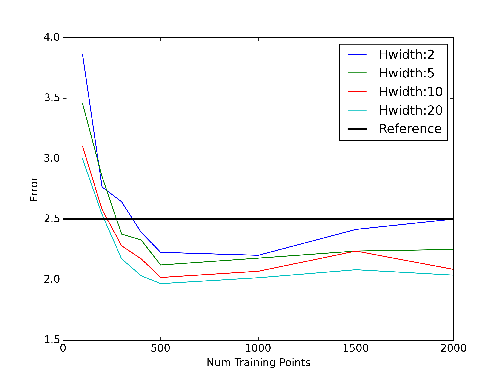
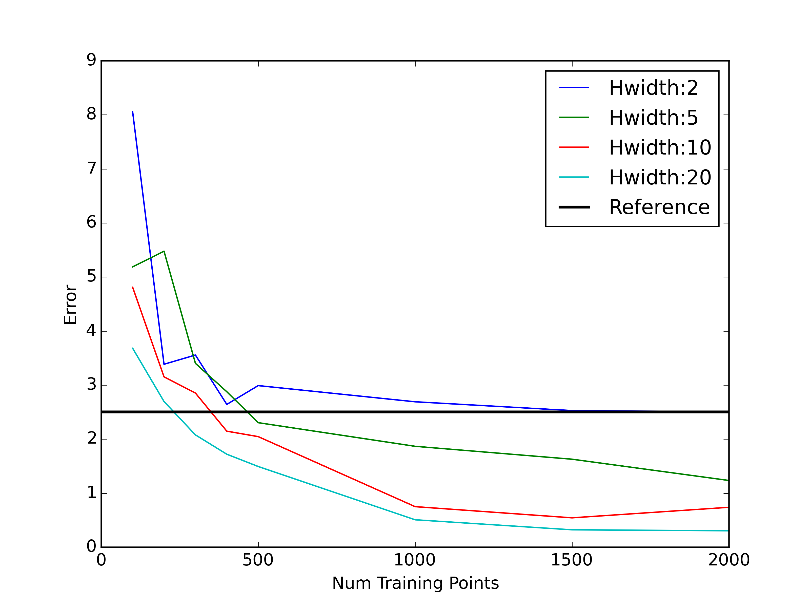
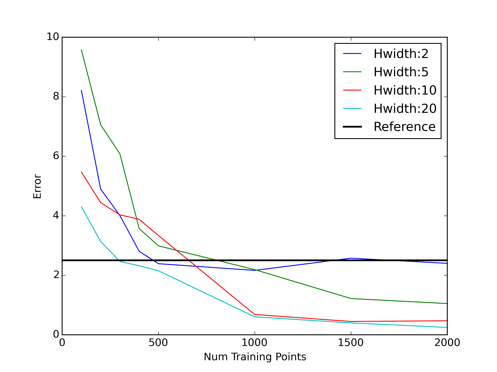
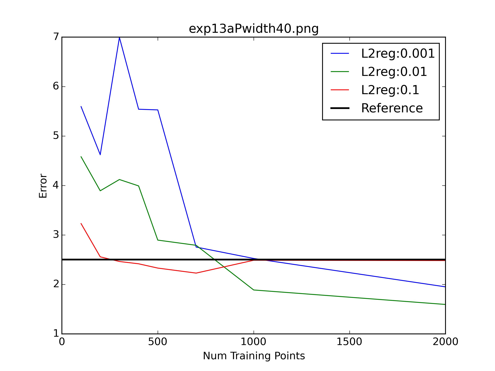

###Dataset with LowD structure

Following meeting with Zoubin, new dataset was generated

x ∈ R50 

L= 10x50 matrix, randomly project x into 10 d subspace
each element of L,ie Lij ~ unif[-1,1]

y=||Lx||

The L2 norm of this 

hence we expect the dataset to have a low intrinsic dimensionality 

A 10D parabola in a 50D space 

The **L** used is also pickled for future use

--

###Exp14

L2reg=0.1

L2reg=0.01

L2reg=0.001

Some good performance with low L2 reg

--
###Exp15

With random projections 

Pwidth=30

Pwidth=40

